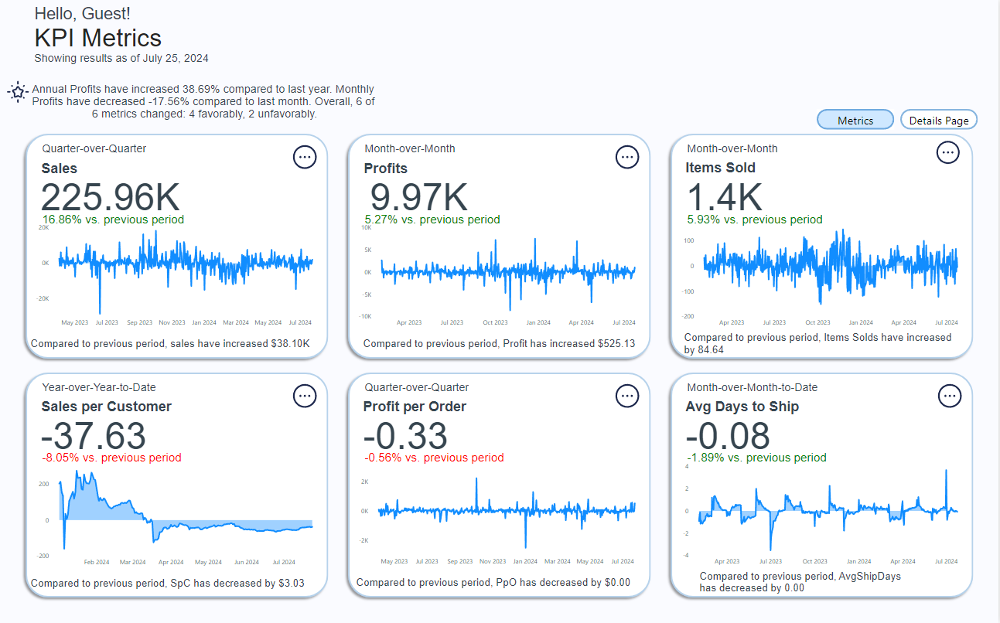

# KPI Insights Dashboard

## Description

The KPI Insights Dashboard provides a comprehensive overview of key performance indicators (KPIs) using interactive data visualizations. This dashboard is designed to help users track and analyze performance metrics in real-time, with features including year-to-date, month-to-date, and custom date range insights. The dashboard is built with Power BI and incorporates dynamic measures and slicers to deliver actionable business intelligence.
Visit at: https://shorturl.at/YI1VG

